# The quest for the fastest LR(1) parser generator in JavaScript

- [Intro](#intro)
- [Optimizing the DFA](#optimizing-the-dfa)
  - [(side-quest) porting the DFA to AssemblyScript](#side-quest-porting-the-dfa-to-assemblyscript)
  - [(side-quest) porting the DFA to C](#side-quest-porting-the-dfa-to-c)
  - [(side-quest) compiling the DFA to WebAssembly](#side-quest-compiling-the-dfa-to-webassembly)
- [Optimizing the parser](#optimizing-the-parser)
  - [(side-quest) analysing the overhead of deoptimization checks](#side-quest-analysing-the-overhead-of-deoptimization-checks)
  - [(side-quest) porting the parser to C](#side-quest-porting-the-parser-to-c)
  - [(side-quest) porting the parser to bison](#side-quest-porting-the-parser-to-bison)
  - [(side-quest) directly executable LR parser](#side-quest-directly-executable-lr-parser)

## Intro

JavaScript tooling is slow. Specifically parsers and bundlers for JS written in JS (see also the [FAQ page of esbuild](https://esbuild.github.io/faq/#why-is-esbuild-fast)).

This has also been discovered by other people and so we've seen a lot of new parsers and bundlers for JS pop up in the past two or so years, which are written in other languages than JavaScript ([swc](https://github.com/swc-project/swc) is a fast TypeScript/JavaScript transpiler written in Rust, [esbuild](https://github.com/evanw/esbuild) is an extremely fast bundler and minifier written in Go and [simdjson](https://github.com/simdjson/simdjson) can parse gigabytes of JSON per second).

But we as JavaScript developers know, that good JavaScript doesn't need to be slow - in fact, there are many articles comparing the speed of V8 to native C and C++ code and in some cases, V8 comes very close ([comparison of C++ in Node.js native addons vs JavaScript](https://medium.com/the-node-js-collection/speed-up-your-node-js-app-with-native-addons-5e76a06f4a40) by Franziska Hinkelmann and [here is another comparison of C++ vs JavaScript](https://www.researchgate.net/publication/336408691_PERFORMANCE_COMPARISON_OF_C_AND_JAVASCRIPT_NODEJS_-V8_ENGINE). [This](https://www.stefankrause.net/wp/?p=144) is an older blog post comparing Java vs C++ vs JavaScript and there are [many](https://stackoverflow.com/questions/27432973/why-is-this-nodejs-2x-faster-than-native-c) [similar](https://stackoverflow.com/questions/39360403/how-can-node-js-be-faster-than-c-and-java-benchmark-comparing-node-js-c-java) questions on SO comparing C/C++ to JS. Of course we also did some comparisons of our code vs C code which we will show later).

We've pondered with the idea of building a fast JS parser in JS for quite a while too and decided to tackle this now.

Since we didn't want to create yet another handwritten recursive descent parser, we've decided to build an LR(1) parser generator, that can generate us the fastest possible parser and allows us to quickly iterate on performance improvements by changing the code generation.

We started by implementing a DFA which is the heart of our lexer (and will also be used inside the parser). Once we had a DFA that was capable of evaluating regular expressions, we began to optimize the generated code to be as fast as possible.

## Optimizing the DFA

To measure our DFA and find performance bottlenecks, we set up the following test code:

```javascript
const { performance } = require('perf_hooks');

const regex = "ab(c|d)(e|f)*((gh|ij)(kl|mn))*";
const string = "abcffghmnijmn";
const input = new TextEncoder().encode(string);
const regexp = new RegExp(regex);
const iterations = 25_000_000;

/*
const dfa = DFA.fromNFA(
  NFA.fromRegExp(regex)
)
  .minimal()
  .automata();

// generates us our optimized DFA whose code we will see in the next section
*/
const dfa = /* our generated code */;

{
  // make the function hot
  for (let i = 0; i < 1_000; i++) {
    dfa(input);
  }

  const start = performance.now();

  for (let i = 0; i < iterations; i++) {
    dfa(input);
  }

  console.log(
    `${iterations.toLocaleString()} iterations of dfa took ${(
      performance.now() - start
    ).toFixed(2)}ms`
  );
}

{
  // make the expr hot
  for (let i = 0; i < 1_000; i++) {
    regexp.test(string);
  }

  const start = performance.now();

  for (let i = 0; i < iterations; i++) {
    regexp.test(string);
  }

  console.log(
    `${iterations.toLocaleString()} iterations of RegExp took ${(
      performance.now() - start
    ).toFixed(2)}ms`
  );
}
```

Here is the generated code for our DFA, it consists of one big array whose indices are the states and each state contains an object that maps character codes to the next state:

```javascript
const table = [
  {
    97: 10,
    102: 0,
    103: 8,
    105: 9,
    // cut down for brevity
  },
  {
    97: 10,
    102: 10,
    103: 8,
    105: 9,
    // cut down for brevity
  },
  // here are many more of these
];
const finals = [0, 1];

const dfa = (input) => {
  let state = 7;
  for (let i = 0, l = input.length; i < l; i++) {
    state = table[state][input[i]];
  }
  return finals.includes(state);
};
```

_See the entire code [here (01-measure.js)](./dfa/01-measure.js)._

Running the above test code to compare it against the native `RegExp` implementation in V8 yielded the following results:

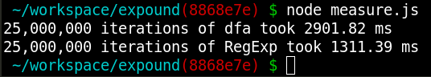

Ouch. V8's native `RegExp` is more than twice as fast. Time to get our hands dirty and figure out why.

First, we took a look at deoptigate to figure out if there are any deoptimizations or megamorphic structures:

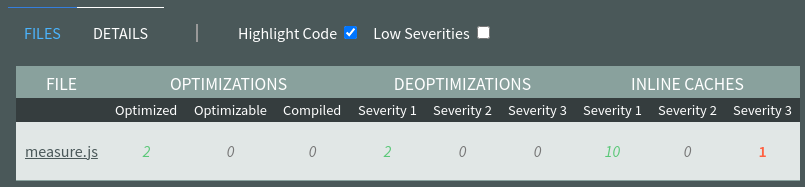

Let's take a closer look as to why our function becomes megamorphic:

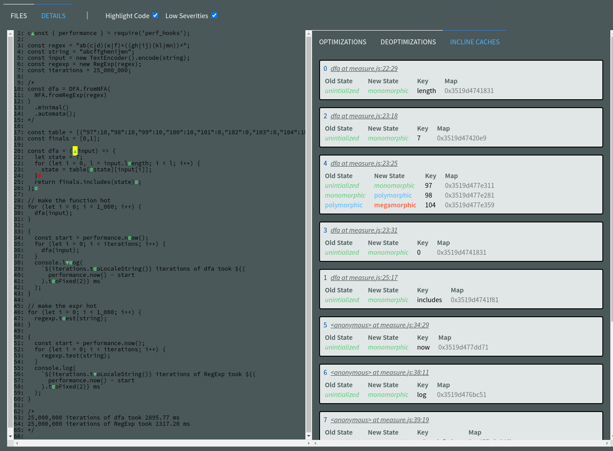

As we can see from the above screenshot, our function becomes megamorphic because the objects we use to map ASCII codes to their next state are all of different shapes.

We then switched to a `TypedArray` for our transitions table and encoded the two dimensional index (`state` and `character code`) as a single index by multiplying the number of states with the number of all possible input characters (`256` in our case).
This meant trading memory for speed, because we now fill a large array whereas we previously had small objects inside an array:

```diff
+ const columns = 256;
+ const states = ["S0","S1","S2","S3","S4","S5","S6","S7","S8","S9","S10"];
+ const data = new ArrayBuffer(columns * states.length);
+ const table = new Uint8Array(data);
+ Object.entries({"S0":{"a":"S10","b":"S10","c":"S10","d":"S10","e":"S0","f":"S0","g":"S8","h":"S10","i":"S9","j":"S10","k":"S10","l":"S10","m":"S10","n":"S10"},"S1":{"a":"S10","b":"S10","c":"S10","d":"S10","e":"S10","f":"S10","g":"S8","h":"S10","i":"S9","j":"S10","k":"S10","l":"S10","m":"S10","n":"S10"},"S2":{"a":"S10","b":"S10","c":"S0","d":"S0","e":"S10","f":"S10","g":"S10","h":"S10","i":"S10","j":"S10","k":"S10","l":"S10","m":"S10","n":"S10"},"S3":{"a":"S10","b":"S10","c":"S10","d":"S10","e":"S10","f":"S10","g":"S10","h":"S10","i":"S10","j":"S10","k":"S10","l":"S1","m":"S10","n":"S10"},"S4":{"a":"S10","b":"S10","c":"S10","d":"S10","e":"S10","f":"S10","g":"S10","h":"S10","i":"S10","j":"S10","k":"S10","l":"S10","m":"S10","n":"S1"},"S5":{"a":"S10","b":"S2","c":"S10","d":"S10","e":"S10","f":"S10","g":"S10","h":"S10","i":"S10","j":"S10","k":"S10","l":"S10","m":"S10","n":"S10"},"S6":{"a":"S10","b":"S10","c":"S10","d":"S10","e":"S10","f":"S10","g":"S10","h":"S10","i":"S10","j":"S10","k":"S3","l":"S10","m":"S4","n":"S10"},"S7":{"a":"S5","b":"S10","c":"S10","d":"S10","e":"S10","f":"S10","g":"S10","h":"S10","i":"S10","j":"S10","k":"S10","l":"S10","m":"S10","n":"S10"},"S8":{"a":"S10","b":"S10","c":"S10","d":"S10","e":"S10","f":"S10","g":"S10","h":"S6","i":"S10","j":"S10","k":"S10","l":"S10","m":"S10","n":"S10"},"S9":{"a":"S10","b":"S10","c":"S10","d":"S10","e":"S10","f":"S10","g":"S10","h":"S10","i":"S10","j":"S6","k":"S10","l":"S10","m":"S10","n":"S10"},"S10":{"a":"S10","b":"S10","c":"S10","d":"S10","e":"S10","f":"S10","g":"S10","h":"S10","i":"S10","j":"S10","k":"S10","l":"S10","m":"S10","n":"S10"}}).forEach(
+   ([from, transition]) => {
+     const row = states.indexOf(from);
+     Object.entries(transition).forEach(([symbol, to]) => {
+       const char = symbol.charCodeAt(0);
+       const value = states.indexOf(to);
+       table[row * columns + char] = value;
+     });
+   }
+ );
+
+ const finals = [0,1];

const dfa = (input) => {
  let state = 7;
  for (let i = 0, l = input.length; i < l; i++) {
-   state = table[state][input[i]];
+   state = table[state * columns + input[i]];
  }
  return finals.includes(state);
};
```

_See the entire code [here (02-measure.js)](./dfa/02-measure.js)._

And here are the results of that change:

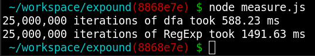

Much better. And deoptigate also shows no more megamorphic inline caches.
Let's continue and see what else we can achieve.

For the next step we've pre-calculated the multiplication of the table indices, which meant that the values in the `TypedArray` are much larger, so we had to switch to a `Uint16Array`, but getting rid of one multiplication instruction per loop iteration saved us another ~50ms:

```diff
+ const table = new Uint16Array(2816).fill(10);
+ table[97] = 2560;
+ table[98] = 2560;
+ table[99] = 2560;
+ table[100] = 2560;
+ table[101] = 0;
+ table[102] = 0;
+ // cut down for brevity

const dfa = (input) => {
- let state = 7;
+ let state = 1792;
  for (let i = 0, l = input.length; i < l; i++) {
-   state = table[state * column + input[i]];
+   state = table[state + input[i]];
  }
  return finals.includes(state);
};
```

_See the entire code [here (03-measure.js)](./dfa/03-measure.js)._

During these improvements we noticed that we were comparing unfairly against V8's RegExp implementation, because our DFA does not handle capturing groups while the RegExp we've written for V8 does use capturing groups.

```diff
const { performance } = require('perf_hooks');

const regex = "ab(c|d)(e|f)*((gh|ij)(kl|mn))*";
const string = "abcffghmnijmn";
const input = new TextEncoder().encode(string);
- const regexp = new RegExp(regex);
+ const regexp = new RegExp("ab(?:c|d)(?:e|f)*(?:(?:gh|ij)(?:kl|mn))*");
const iterations = 25_000_000;
```

_See the entire code [here (03-measure.js)](./dfa/03-measure.js)._

After updating the regexp, V8's time went down from ~1400ms to ~860ms and our changes gaves us another ~50ms for the DFA execution time.

We're now about 300ms faster than the native implementation:

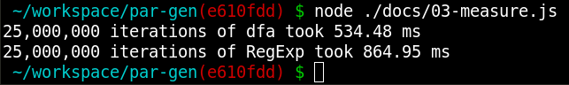

### (side-quest) porting the DFA to AssemblyScript

Next we ported the DFA to [AssemblyScript](https://www.assemblyscript.org/) to compare its performance to the JS version.

The change was fairly easy to implement:

```diff
- const table = new Uint16Array(2816).fill(10);
+ const table = new Int32Array(2816).fill(10);
table[97] = 2560;
table[98] = 2560;
table[99] = 2560;
table[100] = 2560;
table[101] = 0;
table[102] = 0;
// cut down for brevity

+ const input = new Int32Array(13);
+ input[0] = 97;
+ input[1] = 98;
+ input[2] = 99;
+ input[3] = 102;
+ input[4] = 102;
+ input[5] = 103;
+ input[6] = 104;
+ input[7] = 109;
+ input[8] = 110;
+ input[9] = 105;
+ input[10] = 106;
+ input[11] = 109;
+ input[12] = 110;

- const dfa = (input) => {
+ export funtion dfa(): bool {
  let state = 1792;
  for (let i = 0; i < 13; i++) {
    state = table[state + input[i]];
  }
  return state === 0 || state === 256;
};
```

_See the entire code [here (04-assemblyscript.ts)](./dfa/04-assemblyscript.ts)._

Note: We've inlined the input array for our tests, because we wanted te measure just the processing performance without the overhead of copying / transferring the array between JavaScript and WebAssembly for now.

Even though we tried several variations on the optimization levels and told the compiler to not inline any runtime helpers the generated WebAssembly contained several helper functions to deal with TypedArrays and even had some `call`s in the hot loop which made its performance much worse than anticipated.

```
asc 04-assemblyscript.ts --target release -O3z --converge --noAssert --runtime none --noExportMemory --pedantic
```

_See the generated WAT file [here (04-assemblyscript.wat)](./dfa/04-assemblyscript.wat)._

### (side-quest) porting the DFA to C

Coming soon...

### (side-quest) compiling the DFA to WebAssembly

_Todo:_ need to rework this section (liftoff vs turbofan, comparing machine code generated by turbofan (wasm) vs turbofan (js) vs native)

We then ported the DFA to C and compiled it using clang to WebAssembly and to a native binary as comparison and here are the results of that:

Compiling to a native binary:

```
clang -O3 dfa_main.c dfa.c -o dfa.bin
```

Compiling to WebAssembly using clang:

```
clang  --target=wasm32 -O3 -nostdlib -Wl,--no-entry -Wl,--export-all -o dfa.wasm dfa_main.c dfa.c && wasm2wat dfa.wasm > dfa.wat
```


_See the source code for [04-dfa.c](./dfa/04-dfa.c), [04-dfa_main.c](./dfa/04-dfa_main.c), [04-measure.js](./dfa/04-measure.js) and [04-webassembly.wat](./dfa/04-webassembly.wat)._

For now we don't see any other improvements that could help us make our DFA faster (it's basically a 3 line function anyway).
We've tried a few other optimizations, such as:

- using a while loop that counts down to zero
- trying to signal V8 that all integers are 32bit unsigned by using old `asm.js` tricks (`state = table[state + input[i|0]];`)
- and many other things, which didn't bring much discernible difference

And since most of our tools (deoptigate, node clinic, perf, etc) could not give us more insights, we continued working on the parser.
Later, when we had a working parser and lexer, we've found some more things to optimise, but more on that later.

## Optimizing the parser

At this stage we felt pretty good about the performance of our DFA and continued implementing the LR(1) parser generator.
Once we had it working we created a JSON grammar to generate a JSON parser that we could compare to others.

We set-up a simple benchmarking script to compare our parser to V8's `JSON.parse()`:

```javascript
import { performance } from "perf_hooks";
import { parse } from "./generated/parser.js";

const buffer = Buffer.from(" [ true , false , null ] ");
const string = buffer.toString();
const iterations = 100_000;

{
  // make the function hot
  for (let i = 0; i < 1_000; i++) {
    parse(buffer);
  }

  const start = performance.now();
  for (let i = 0; i < iterations; i++) {
    parse(buffer);
  }
  console.log(
    `${iterations.toLocaleString()} iterations of our parser took ${(
      performance.now() - start
    ).toFixed(2)} ms`
  );
}
{
  const start = performance.now();
  for (let i = 0; i < iterations; i++) {
    JSON.parse(string);
  }
  console.log(
    `${iterations.toLocaleString()} iterations of our parser took ${(
      performance.now() - start
    ).toFixed(2)} ms`
  );
}
```

Below is a shortened example of our generated lexer:

```javascript
const states = [
  "WS",
  "CHAR",
  "LOWER_E",
  // here are many more entries...
];

const table = new Uint16Array(15360).fill(15104);
table[32] = 15104; // 0 -> 59
table[116] = 15104; // 0 -> 59
table[114] = 15104; // 0 -> 59
// here are many more entries...

const visited = new Uint16Array(1024);

const next = (input, offset) => {
  // 51
  let state = 13056;
  visited[0] = 13056;

  // try to find match
  let i = offset;
  let j = 0;
  let l = input.length;
  while (i < l) {
    state = table[state + input[i]];
    i++;
    j++;
    visited[j] = state;
  }

  // track back to last matched final state
  let success = false;
  let n = j;
  while (!success && n > 0) {
    success =
      0 === visited[n] ||
      256 === visited[n] ||
      512 === visited[n] ||
      768 === visited[n] ||
      // here are many more entries in increments of 256 all the way up to 12800
      12800 === visited[n];
    n--;
  }
  n = n + 1;

  if (success) {
    return {
      state: states[visited[n] / 256],
      start: offset,
      end: offset + n,
    };
  }
  return {
    state: i === input.length ? EOF : ERROR,
    start: -1,
    end: -1,
  };
};
```

And here is a simplified example of our generated parser:

```javascript
import { next as nextToken } from "./lexer.js";

const states = [
  new Set([
    { name: "S", tokens: ["Json"], marker: 0, lookahead: "@expound.EOF" },
    { name: "Json", tokens: ["Element"], marker: 0, lookahead: "@expound.EOF" },
    // many more entries
  ]),
  // many more entries
];

const startState = states[0];

const actions = new Map([
  [
    states[0],
    new Map([
      [
        "WS",
        {
          op: "shift",
          symbol: undefined,
          state: states[1],
        },
      ],
      // many more entries
    ]),
  ],
  // many more entries
]);

const goto = new Map([
  [
    states[0],
    new Map([
      ["Json", states[2]],
      ["Element", states[3]],
      // many more entries
    ]),
  ],
  // many more entries
]);

export function parse(input) {
  const stream = Uint8Array.from(Buffer.from(input));
  let offset = 0;

  let result = nextToken(stream, offset);
  let { state: lookahead, start, end } = result;
  offset = end;

  const stack = [
    {
      state: startState,
      tree: undefined,
    },
  ];

  while (true) {
    const currentState = stack[0].state;

    const actionSet = actions.get(currentState);
    const action = actionSet.get(lookahead);

    switch (action.op) {
      case "done":
        return stack[0].tree;
      case "shift":
        const stackItem = {
          state: action.state,
          tree: { name: lookahead, start, end },
        };

        result = nextToken(stream, offset);
        lookahead = result.state;
        start = result.start;
        offset = end = result.end;

        stack.unshift(stackItem);

        break;
      case "reduce":
        const item = Array.from(currentState.values()).find(
          (item) => item.name === action.symbol && item.lookahead === lookahead
        );
        const items = stack.splice(0, item.tokens.length);

        const tree = {
          name: action.symbol,
          // the stack grows from 0 to n -> we need to reverse the parse tree
          items: items.map((r) => r.tree).reverse(),
        };

        const nextState = goto.get(stack[0].state)?.get(action.symbol);
        stack.unshift({
          state: nextState,
          tree,
        });

        break;
    }
  }
}
```

Running the above benchmark with this simple JSON input `" [ true , false , null ] "` gave us the following output:

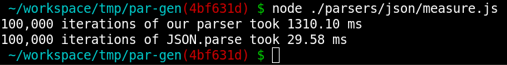

We are almost 45x slower than the native `JSON.parse`. Let's take a look at some tools to figure out what is going on.

We started by taking a look at Linux's `perf` tool to see where most of our time is spent.

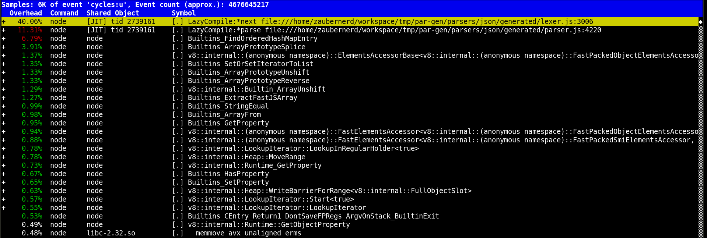

_The above output was generated by running our Node.js script with `perf record -g node --perf-basic-prof ./measure.js` and then generating the report with `perf report --no-children`._

We can see in the perf report that about 40% of the time is spent in the lexer's `next()` function. So let's take a look at its source code to figure out what's happening.
One thing that we noticed was that long list of logical OR operators to compare the final state.
We realized that all final states are increments of 256 from 0 to 12800, so we switched it out for a single less-than-equal comparison:

```diff
  while (!success && n > 0) {
-     success =
-       0 === visited[n] ||
-       256 === visited[n] ||
-       512 === visited[n] ||
-       768 === visited[n] ||
-       // here are many more entries in increments of 256 all the way up to 12800
-       12800 === visited[n];
+     success = visited[n] <= 12800;
    n--;
  }
```

That reduced our time for 100k iterations from 1310.10ms to 809.77ms.

The next changes are unfortunately squashed inside a single commit that also updates the JSON grammar to be spec compliant which makes it a bit difficult to extract the single changes and compare them against the baseline, but I'll try my best to re-create what we did.

From the perf report above we saw that the next hottest functions are `Builtins_FindOrderedHashMapEntry`, `Builtins_ArrayPrototypeSplice`, `Builtins_SetOrSetIteratorToList`, `Builtins_ArrayPrototypeUnshift` and `Builtins_ArrayPrototypeReverse`.

We replaced the stack (which was the cause for all the builtins array methods) with a custom stack implementation (an array and a stack pointer variable) and we split-up the actions map into an array of actions and separate `state + lookahead -> action` and `state + action.symbol -> nextState` tables:

```diff
const startState = states[0];

- const actions = new Map([
-   [
-     states[0],
-     new Map([
-       [
-         "WS",
-         {
-           op: "shift",
-           symbol: undefined,
-           state: states[1],
-         },
-       ],
-       // many more entries
-     ]),
-   ],
-   // many more entries
- ]);

- const goto = new Map([
-   [
-     states[0],
-     new Map([
-       ["Json", states[2]],
-       ["Element", states[3]],
-       // many more entries
-     ]),
-   ],
-   // many more entries
- ]);

+ const actions = [
+   {
+     op: "shift",
+     state: 1,
+     symbol: undefined,
+   },
+   // many more shift/reduce entries
+ ];

+ const actionsTable = new Uint16Array(13396).fill(0xffff);
+ actionsTable[1] = 0; // actionTable 0 -> WS -> shift
+ actionsTable[2] = 1; // actionTable 0 -> TRUE -> shift

+ const gotoTable = new Uint16Array(9456).fill(0xffff);
+ gotoTable[0] = 11;
+ gotoTable[1] = 12;

-  const stack = [
-    {
-      state: startState,
-      tree: undefined,
-    },
-  ];

+  const stack = new Array(10);
+  stack[0] = {
+    state: states.indexOf(startState),
+    tree: undefined,
+  };
+  let sp = 0;

export function parse(input) {
-  const stream = Uint8Array.from(Buffer.from(input));
+  const stream = Buffer.from(input);
  let offset = 0;

  let result = nextToken(stream, offset);
  let { state: lookahead, start, end } = result;
  offset = end;
+   let lookaheadIndex = terminals.indexOf(lookahead);

  while (true) {
-     const currentState = stack[0].state;
+     const currentState = stack[sp].state;

-     const actionSet = actions.get(currentState);
-     const action = actionSet.get(lookahead);
+     const actionLookup = actionsTable[currentState * 68 + lookaheadIndex];
+     const action = actions[actionLookup];

    switch (action.op) {
      case "done":
-         return stack[0].tree;
+         return stack[sp].tree;
      case "shift":
        const stackItem = {
          state: action.state,
          tree: { name: lookahead, start, end, items: undefined },
        };

        result = nextToken(stream, offset);
        lookahead = result.state;
+         lookaheadIndex = terminals.indexOf(lookahead);
        start = result.start;
        offset = end = result.end;

-         stack.unshift(stackItem);
+         stack[++sp] = stackItem;

        break;
      case "reduce":
-         const item = Array.from(currentState.values()).find(
-           (item) => item.name === action.symbol && item.lookahead === lookahead
-         );
+         let item;
+         for (const value of states[currentState].values()) {
+           if (value.name === action.symbol && value.lookahead === lookahead) {
+             item = value;
+             break;
+           }
+         }
-         const items = stack.splice(0, item.tokens.length);
+         const items = new Array(item.tokens.length);
+         for (let i = 0; i < item.tokens.length; i++) {
+           items[i] = stack[i + sp + 1 - item.tokens.length].tree;
+         }
+         sp -= item.tokens.length;

        const tree = {
          name: action.symbol,
          start,
          end,
-           // the stack grows from 0 to n -> we need to reverse the parse tree
-           items: items.map((r) => r.tree).reverse(),
+           items,
        };

-         const nextState = goto.get(stack[0].state)?.get(action.symbol);
+         const nextState =
+           gotoTable[stack[sp].state * 48 + nonTerminals.indexOf(action.symbol)];
-         stack.unshift({
+         stack[++sp] = {
          state: nextState,
          tree,
-         });
+         };

        break;
    }
  }
}
```

Unfortunately the next commits were squashed and contained more changes (such as making the JSON grammar complete), so its overall runtime increased compared to the previous run. We are now at about 2100ms for 100k iterations.
But here is a screenshot of the perf report after all these changes and we can definitely see an improvement there:

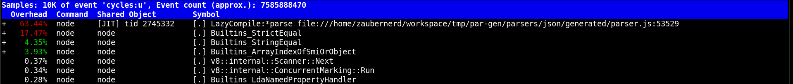

Many of the array and map builtins are now gone and we can see that a lot more time is now spent in our `parse()` function.

We were able to save another 100ms by exiting the lexer loop early when encountering an error state:

```diff
const next = (input, offset) => {
  // 51
  let state = 13056;
  visited[0] = 13056;

  // try to find match
  let i = offset;
  let j = 0;
  let l = input.length;
-   while (i < l) {
+   while (state !== 11776 && i < l) {
    state = table[state + input[i]];
    i++;
    j++;
    visited[j] = state;
  }
```

Another huge boost was achieved by skipping searching for semantic actions if they are not required. This brought the time down from ~2000ms to ~344ms for 100k iterations.

```diff
      case "shift":
        const stackItem = {
          state: action.state,
          tree: { name: lookahead, start, end, items: undefined },
        };

-         for (const item of states[currentState].values()) {
-           if (item.tokens[item.marker] === lookahead) {
-             item.semanticAction?.(stack, sp);
-           }
-         }

        result = nextToken(stream, offset);
```

Replacing all `indexOf` calls by pre-computing the table indizes and replacing all strings with constant integers we've managed to further reduce the time from ~344ms to ~268ms. Compared to the `JSON.parse` function we're now only 10x slower instead of the initial 45x.

We increased the number of iterations from 100k to 1 million and here is the comparison:

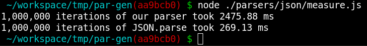

The next big improvement was reducing the number of shift/reduce steps by rewriting our JSON grammar. Previously we had productions to handle whitespaces and numbers in our syntactical grammar, by moving this entirely into the lexer we were able to reduce the time from ~2500ms to ~1800ms.

We've got another 300ms through various optimizations:

We reduced garbage collector work by re-using a single object allocated in the lexer to return its state:

```diff
const visited = new Uint16Array(1024);

+ // the currently matched lexeme
+ const lexeme = {
+   state: -1,
+   start: -1,
+   end: -1,
+ };

const next = (input, offset) => {

  if (success) {
-    return {
-      state: tokenIds[visited[n] / 256 + 2],
-      start: offset,
-      end: offset + n,
-    };
+    lexeme.state = tokenIds[visited[n] / 256 + 2];
+    lexeme.start = offset;
+    lexeme.end = offset + n;
+    return lexeme;
  }
-  return {
-    state: i === l ? 0 : 1,
-    start: -1,
-    end: -1,
-  };
+  lexeme.state = i === l ? 0 : 1;
+  lexeme.start = -1;
+  lexeme.end = -1;
+  return lexeme;
};
```

```diff
export function parse(input) {
  const stream = Uint8Array.from(Buffer.from(input));

-  let result = nextToken(stream, offset);
-  let { state: lookahead, start, end } = result;
-  offset = end;
+  let result = nextToken(stream, 0);
+  let lookahead = result.state;
+  let start = result.start;
+  let end = result.end;
+  let offset = end;
```

We further reduced garbage collector work by splitting the stack array into two arrays, one for the state stack and another one for the created tree, this meant we're creating less objects that are thrown away:

```diff
   let end = result.end;
   let offset = end;

-  const stack = new Array(10);
-  stack[0] = {
-    state: 0,
-    tree: undefined,
-  };
+  const stack = new Uint8Array(512);
+  const treeStack = new Array(512);
+  stack[0] = 0;
   let sp = 0;

   while (true) {
-    const currentState = stack[sp].state;
+    const currentState = stack[sp];

     const actionLookup = actionsTable[currentState * 30 + lookahead];

       case 0: // shift
-        const stackItem = {
-          state: action.state,
-          tree: {
-            name: parserSymbols[lookahead],
-            start,
-            end,
-            items: undefined,
-          },
+        stack[++sp] = action.state;
+        treeStack[sp] = {
+          name: parserSymbols[lookahead],
+          start,
+          end,
+          items: undefined,
         };

         result = nextToken(stream, offset);

      case 2: // reduce

-        const nextState = gotoTable[stack[sp].state * 26 + action.symbol];
-        stack[++sp] = {
-          state: nextState,
-          tree,
-        };
+        const nextState = gotoTable[stack[sp] * 26 + action.symbol];
+        stack[++sp] = nextState;
+        treeStack[sp] = tree;
```

We replaced an inner loop in the `parse()` function to find the reducer state with an indexed access into an array:

```diff
       case 1: // reduce
-        let item;
-        for (const value of states[currentState].values()) {
-          if (value.name === action.symbol && value.lookahead === lookahead) {
-            item = value;
-            break;
-          }
-        }
-        if (!item) {
-          throw new Error(
-            `No valid state ${
-              grammarRuleNames[action.symbol]
-            }(${lookahead}) found`
-          );
-        }
+        let stackItemsToReduce =
+          reducerStates[
+            lookahead * 2688 + currentState * 32 + action.symbol
+          ];

-        const items = new Array(item.tokens.length);
-        for (let i = 0; i < item.tokens.length; i++) {
-          items[i] = treeStack[i + sp + 1 - item.tokens.length];
+        const items = new Array(stackItemsToReduce);
+        for (let i = 0; i < stackItemsToReduce; i++) {
+          items[i] = treeStack[i + sp + 1 - stackItemsToReduce];
         }
-        sp -= item.tokens.length;
+        sp -= stackItemsToReduce;

         const nextState = gotoTable[stack[sp] * 26 + action.symbol];
```

We replaced `Buffer.from(input)` with `Buffer.isBuffer(input) ? input : Buffer.from(input)`.

And we moved the array creation outside of the `parse()` function.

we're now down to ~1500ms for a loop of 1 million iterations.

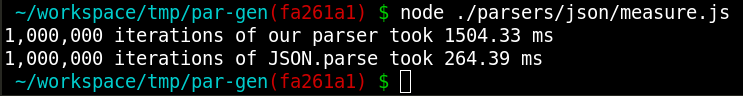

Let's take another look at the perf report:

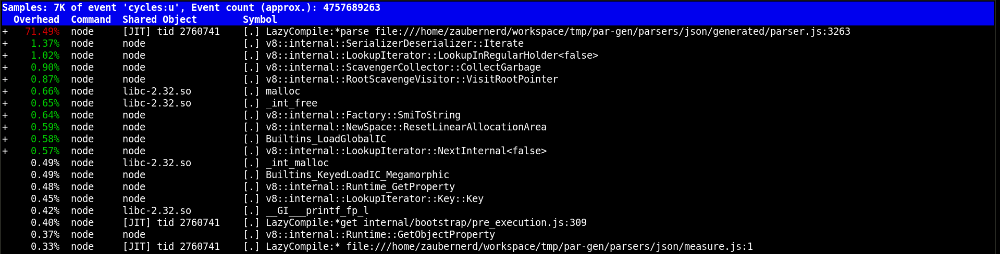

We still have a lot of garbage collection and allocations going on. Looking at the code, it seems to be the tree objects that we create in every iteration of the parse loop.
We then replaced the object tree with a typed array and a Proxy to access it. This reduced our time from about 1500ms to about 660ms.

```javascript
/**
 * We use the stack to store shifted/reduced states in [sp] and we also use
 * [sp + 1] to store the tree pointer references to shifted/reduced nodes.
 * This allows us to use a single typed array to store two kinds of data.
 * * [sp] always points to the current state on top of the stack and
 * * [sp + 1] always points to the tree item currently on top of the stack
 * ___________________________________
 * |_dummy_|_state_|_tp_|_state_|_tp_|...
 */
const stack = new Uint8Array(512);

/**
 * This typed array contains the syntax tree from a parse.
 * A node is stored in the following layout:
 * struct Node {
 *  name: uint16,
 *  start: uint16,
 *  end: uint16,
 *  numChildren: uint16,
 *  firstChild: uint16,
 *  nextSibling: uint16,
 * }
 * This enables efficient storage of nodes with variable number of children and
 * fast DFS traversal.
 */
const tree = new Uint16Array(8192);
```

```diff
       case 0: // shift
-        stack[++sp] = action.state;
-        treeStack[sp] = {
-          name: parserSymbols[lookahead],
-          start: result.start,
-          end: result.end,
-          items: undefined,
-        };
+        tree[tp] = lookahead; // name
+        tree[tp + 1] = result.start;
+        tree[tp + 2] = result.end;
+        tree[tp + 3] = 0; // leaf nodes have no children
+        tree[tp + 4] = 0; // leaf nodes need no first child
+        tree[stack[sp - 1] + 5] = tp; // write the current address to the previous item as next sibling
+
+        // shift current address on top of "address stack"
+        stack[sp + 1] = tp;
+
+        sp += 2;
+        stack[sp] = action.state;

         result = nextToken(stream, result.end);

       case 2: // reduce

-        const items = new Array(stackItemsToReduce);
-        for (let i = 0; i < stackItemsToReduce; i++) {
-          items[i] = treeStack[i + sp + 1 - stackItemsToReduce];
-        }
-        sp -= stackItemsToReduce;
+        // multiply by two because our stack contains adresses and states interleaved
+        sp -= stackItemsToReduce * 2;
+
+        tree[tp] = action.symbol; // name
+        tree[tp + 1] = -1; // start
+        tree[tp + 2] = -1; // end
+        tree[tp + 3] = stackItemsToReduce; // number of children
+        tree[tp + 4] = stack[sp + 1]; // first child
+        tree[stack[sp - 1] + 5] = tp; // next sibling
+
+        stack[sp + 1] = tp;

         const nextState = gotoTable[stack[sp] * 32 + action.symbol];
-        stack[++sp] = nextState;
-        treeStack[sp] = {
-          name: parserSymbols[action.symbol],
-          start: -1,
-          end: -1,
-          items,
-        };
+        sp += 2;
+        stack[sp] = nextState;

         break;
```

Here is a comparison of parsing a somewhat more complex object (our own `package.json`):

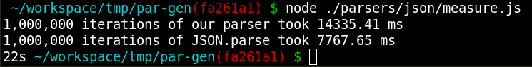

And let's also take a look at the perf report for parsing a `package.json`:

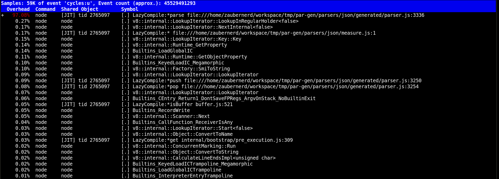

### (side-quest) analysing the overhead of deoptimization checks

_Todo:_ https://masc.soe.ucsc.edu/docs/iiswc16.pdf, learning about the sea-of-nodes, bounds-check elimination, exploitation, patching Node.js to remove all deoptimization checks (10-15% improvement)

### (side-quest) porting the parser to C

_Todo:_ comparing performance of native C to V8 JS (8s native, 9s V8's JSON.parse, 14s our parser, 11s our parser without deoptimization checks)

### (side-quest) porting the parser to Bison

_Todo:_ using our own lexer, comparing performance to our parser ported to C (8s native, 8.5s bison (without tree creation))

### (side-quest) directly executable LR parser

_Todo:_ https://link.springer.com/content/pdf/10.1007/3-540-53669-8_82.pdf - "readable parser" (a function for each shift/reduce action), "executable parser" (single function with nested switch/case instructions)
